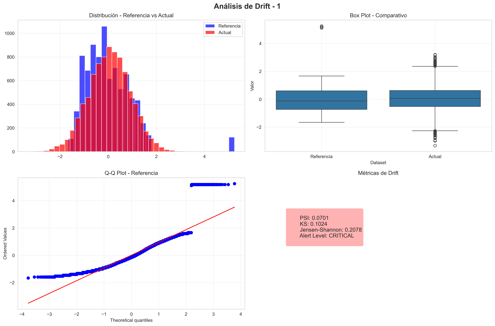
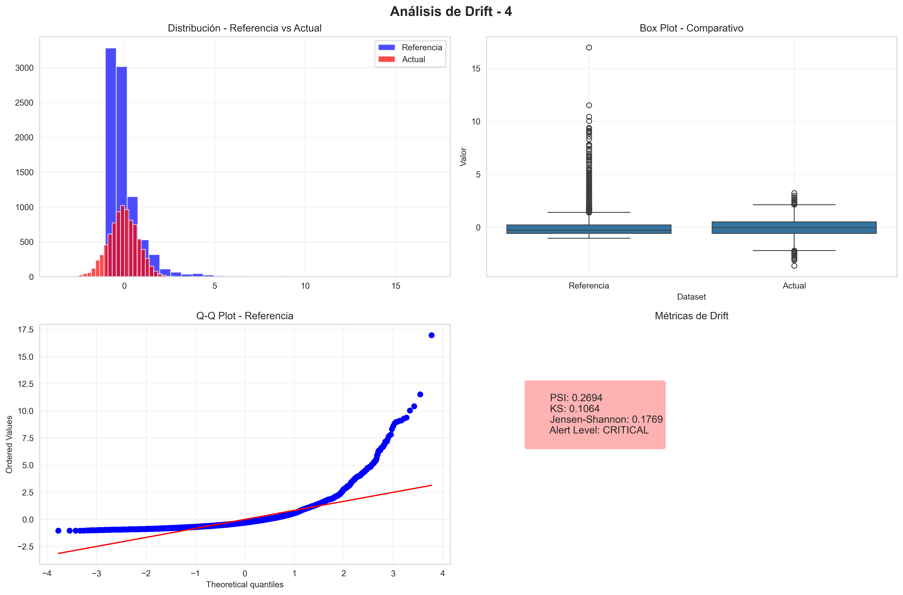
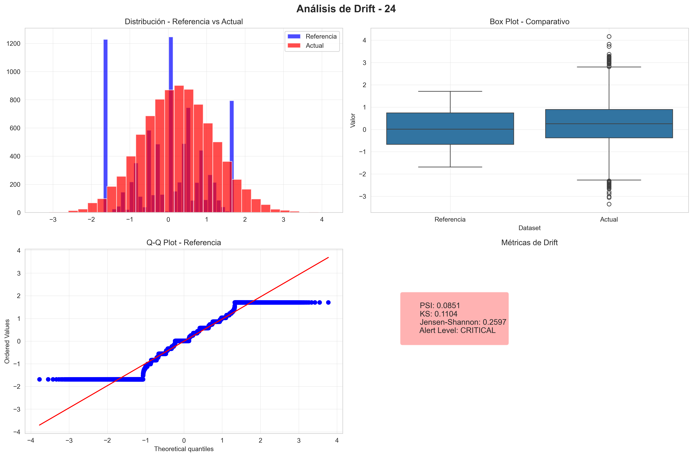

# 🔍 Model Monitoring System

Bienvenido a la documentación del sistema de monitoreo de modelos. Este módulo, implementado en `model_monitoring.py`, es el corazón de la observabilidad de nuestra pipeline de MLOps. Su objetivo principal es garantizar que el modelo mantenga su precisión y relevancia a lo largo del tiempo, detectando cualquier desviación en los datos de entrada (**Data Drift**) o en el comportamiento del modelo.

---

## 🛠️ El Proceso de Monitoreo

El sistema sigue un flujo de trabajo riguroso dividido en 6 fases clave:

### 1. Inicialización y Carga de Artefactos
Se cargan los componentes críticos para establecer la línea base:
- **Datos de Referencia:** El dataset original de entrenamiento (`data_referencia.csv`).
- **Modelo Entrenado:** El pipeline de clasificación actual.
- **Metadatos:** Información sobre el rendimiento histórico y configuración del modelo.

### 2. Ingesta de Datos Nuevos
El sistema simula o recibe datos de producción. Estos datos pasan por el mismo proceso de **Feature Engineering** definido en `ft_engineering.py` para asegurar la consistencia en el análisis.

### 3. Evaluación de Data Drift
Se comparan estadísticamente las distribuciones de los datos de referencia contra los datos nuevos utilizando múltiples métricas:
- **PSI (Population Stability Index):** Mide la estabilidad de la población.
- **KS (Kolmogorov-Smirnov):** Detecta cambios en la forma de la distribución.
- **Jensen-Shannon:** Evalúa la similitud entre distribuciones probabilísticas.
- **Chi-Cuadrado:** Específico para validar el drift en variables categóricas y predicciones.

### 4. Generación de Alertas
Basado en umbrales predefinidos, el sistema clasifica el estado de cada variable:
- ✅ **NORMAL:** Sin desviaciones significativas.
- ⚡ **WARNING:** Cambios leves detectados ($PSI > 0.1$).
- 🚨 **CRITICAL:** Cambios severos que requieren reentrenamiento ($PSI > 0.25$).

### 5. Reporteo Automático
Se generan artefactos visuales y técnicos para la toma de decisiones.

### 6. Integración con Dashboard
Los resultados se empaquetan para ser visualizados en tiempo real mediante Streamlit.

---

## 📊 Recursos y Artefactos (Assets)

El sistema genera y utiliza los siguientes recursos ubicados en la carpeta `assets/`:

### Reportes Técnicos
- [**Reporte Interactivo (HTML)**](../assets/drift_report.html): Una vista web completa con el resumen de todas las variables analizadas y sus niveles de alerta.
- [**Datos de Drift (JSON)**](../assets/drift_report.json): Formato estructurado para integración con otros sistemas de monitoreo o logs.

### Análisis Visual de Variables
Para las variables que presentan alertas, el sistema genera gráficos de diagnóstico profundo. Puedes ver ejemplos de los análisis realizados aquí:

| Variable 1 Analysis | Variable 4 Analysis | Variable 24 Analysis |
|:---:|:---:|:---:|
|  |  |  |

*Estos gráficos comparan histogramas, box-plots y Q-Q plots para diagnosticar la naturaleza del drift.*

### Datos para el Dashboard
- **`streamlit_dashboard_data.pkl`**: Archivo serializado que contiene el estado actual del monitoreo, listo para ser consumido por la interfaz de usuario.

---

## 🚀 Cómo Ejecutar el Monitoreo

Para ejecutar una ronda completa de monitoreo y actualizar todos los assets, simplemente corre:

```bash
python src/model_monitoring.py
```

---
> **Nota:** Este sistema es fundamental para la estrategia de **Continuos Monitoring (CM)** en nuestra arquitectura de MLOps.
